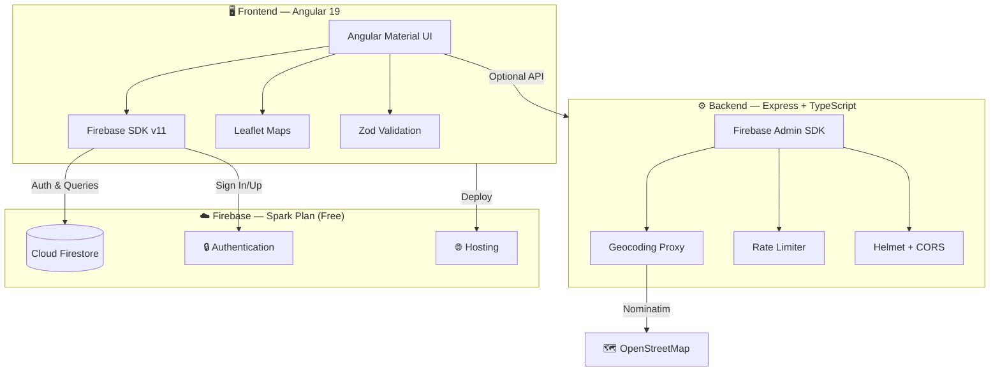

<div align="center">

<!-- Badges Row 1 — Tech Stack -->


# 🔐 Customer Vault

**A modern, secure customer management platform**
*Built with Angular 19 · Firebase · OpenStreetMap*

[](https://customer-manager-aa404.web.app)
[](LICENSE)
[](https://github.com/KaliYugaLabs/ng-node-firebase/pulls)

---

*Manage customers, verify identities, and geocode addresses — all for **$0/month**.*

</div>

---

## 📸 Preview

> **Coming soon** — screenshots of the live dashboard, customer form, and login page.

<!-- Uncomment and replace with actual screenshots when available:
<div align="center">

<br><br>


</div>
-->

---

## ✨ Features

<table>
<tr>
<td width="50%">

### 🔑 Authentication
- Email/password registration & login
- Password reset via email
- Persistent sessions across tabs
- Protected routes with Angular guards

</td>
<td width="50%">

### 👥 Customer Management
- Full CRUD operations
- Real-time search & filtering
- South African ID validation (13-digit)
- Per-user data isolation

</td>
</tr>
<tr>
<td width="50%">

### 🗺️ Address & Maps
- OpenStreetMap address autocomplete
- Automatic geocoding (lat/lng)
- Leaflet interactive maps
- Zero-cost — no API key needed

</td>
<td width="50%">

### 🛡️ Security
- Firestore rules with field validation
- JWT token authentication
- Rate limiting (100 req/15min)
- Helmet.js, CORS, XSS protection

</td>
</tr>
</table>

---

## 🏗️ Architecture



---

## 💻 Tech Stack

<div align="center">

| Layer | Technology | Purpose |
|:------|:-----------|:--------|
| **Frontend** | Angular 19, Material 19 | SPA with standalone components & Signals |
| **Database** | Cloud Firestore | Real-time NoSQL with offline support |
| **Auth** | Firebase Auth | Email/password with session persistence |
| **Maps** | Leaflet + Nominatim | Free interactive maps & geocoding |
| **Validation** | Zod | Runtime schema validation (client + server) |
| **Backend** | Express 4.21, TypeScript | Optional API with Firebase Admin SDK |
| **Security** | Helmet, CORS, Rate Limit | Production-grade HTTP security |

</div>

---

## 🚀 Quick Start

### Prerequisites

```
Node.js 20+  ·  npm 10+  ·  Firebase Account (free)
```

### 1️⃣ Clone & Install

```bash
git clone https://github.com/KaliYugaLabs/ng-node-firebase.git
cd ng-node-firebase
cd frontend-v2 && npm install
```

### 2️⃣ Firebase Setup

<details>
<summary><strong>Click to expand Firebase setup instructions</strong></summary>

1. Create a project at [Firebase Console](https://console.firebase.google.com/)
2. Enable **Firestore Database** → Production mode → `us-central`
3. Enable **Authentication** → Email/Password provider
4. Register a **Web App** → copy the config object
5. *(Optional)* Generate a **Service Account** key for the backend

</details>

### 3️⃣ Configure

```bash
# Edit with your Firebase credentials
code frontend-v2/src/environments/environment.ts
```

```typescript
export const environment = {
  production: false,
  firebase: {
    apiKey: 'YOUR_API_KEY',
    authDomain: 'YOUR_PROJECT.firebaseapp.com',
    projectId: 'YOUR_PROJECT_ID',
    storageBucket: 'YOUR_PROJECT.appspot.com',
    messagingSenderId: 'YOUR_SENDER_ID',
    appId: 'YOUR_APP_ID'
  },
  apiUrl: 'http://localhost:3000/api/v1',
  nominatimUrl: 'https://nominatim.openstreetmap.org'
};
```

### 4️⃣ Run

```bash
npm start
# → http://localhost:4200
```

### 5️⃣ Deploy Firestore Rules

```bash
firebase login
firebase deploy --only firestore:rules
```

<details>
<summary><strong>🔧 Backend Setup (Optional)</strong></summary>

```bash
cd backend-v2
npm install
cp .env.example .env
# Add your Firebase service account JSON to .env
npm run dev
```

</details>

---

## 📁 Project Structure

```
ng-node-firebase/
│
├── frontend-v2/                 # 🖥️  Angular 19 SPA
│   └── src/
│       ├── app/
│       │   ├── components/
│       │   │   ├── auth/        #     Login & Register
│       │   │   ├── customers/   #     Customer list & form
│       │   │   ├── layout/      #     Shell & 404
│       │   │   └── shared/      #     Reusable components
│       │   ├── services/        #     Auth, Customer, Geocoding
│       │   ├── guards/          #     Route protection
│       │   ├── interceptors/    #     HTTP middleware
│       │   └── models/          #     TypeScript interfaces
│       └── environments/        #     Config per environment
│
├── backend-v2/                  # ⚙️  Express API (optional)
│   └── src/
│       ├── config/              #     Firebase Admin init
│       ├── middleware/          #     Security (Helmet, CORS)
│       ├── routes/              #     API endpoints
│       ├── services/            #     Geocoding proxy
│       └── validation/          #     Zod schemas
│
├── firestore.rules              # 🔒  Security rules
├── firestore.indexes.json       # 📇  Composite indexes
├── firebase.json                # ⚙️  Firebase config
└── docs/                        # 📚  Documentation
```

---

## 📜 Scripts

| Command | Description |
|:--------|:------------|
| `npm start` | Launch dev server at `localhost:4200` |
| `npm run build:prod` | Optimized production build |
| `npm test` | Run unit tests |
| `npm run start:backend` | Start Express API with hot reload |
| `npm run emulators` | Start Firebase emulators |
| `npm run deploy:all` | Deploy to Firebase Hosting |
| `npm run deploy:rules` | Deploy Firestore security rules |

---

## 💰 Cost Comparison

<div align="center">

| | Before | After |
|:-|:------:|:-----:|
| **Maps** | Google Maps — $50-100/mo | OpenStreetMap — **$0** |
| **Database** | Realtime DB — $0-20/mo | Firestore Spark — **$0** |
| **Search** | Elasticsearch — $29-79/mo | Firestore Queries — **$0** |
| **Auth** | Firebase — $0 | Firebase — **$0** |
| **Total** | **$79-199/mo** | **✅ $0/mo** |

</div>

> **Spark plan limits:** 1 GB storage · 50K reads/day · 20K writes/day · 50K MAUs

---

## 🚀 Deployment

| Platform | Command |
|:---------|:--------|
| **Firebase Hosting** | `npm run build:prod && npm run deploy:hosting` |
| **Vercel** | `cd frontend-v2 && npx vercel` |
| **Netlify** | Connect repo → build: `npm run build` → publish: `dist/` |
| **Backend (Railway)** | Push to GitHub → connect → add env vars → deploy |

---

## 🐛 Troubleshooting

<details>
<summary><code>auth/invalid-api-key</code></summary>

Check Firebase config in `environment.ts` — make sure all values match your Firebase Console.
</details>

<details>
<summary><code>Missing or insufficient permissions</code></summary>

Deploy Firestore rules: `firebase deploy --only firestore:rules` and make sure you're logged in.
</details>

<details>
<summary>Address autocomplete not working</summary>

Nominatim has a 1 req/sec limit. Wait a moment and retry. Check browser console for errors.
</details>

<details>
<summary>Port 4200 already in use</summary>

```bash
npx kill-port 4200
# or
ng serve --port 4201
```
</details>

---

## 🤝 Contributing

1. **Fork** the repository
2. **Create** a feature branch — `git checkout -b feature/awesome`
3. **Commit** your changes — `git commit -m 'Add awesome feature'`
4. **Push** — `git push origin feature/awesome`
5. **Open** a Pull Request

---

## 📄 License

This project is licensed under the **MIT License** — free for personal and commercial use.

---

<div align="center">

### Built with ❤️ by [KaliYugaLabs](https://github.com/KaliYugaLabs)

*Originally forked from [rikusv/ng-node-firebase](https://github.com/rikusv/ng-node-firebase) — modernized with Angular 19, Firebase v11, and free geocoding.*


</div>
